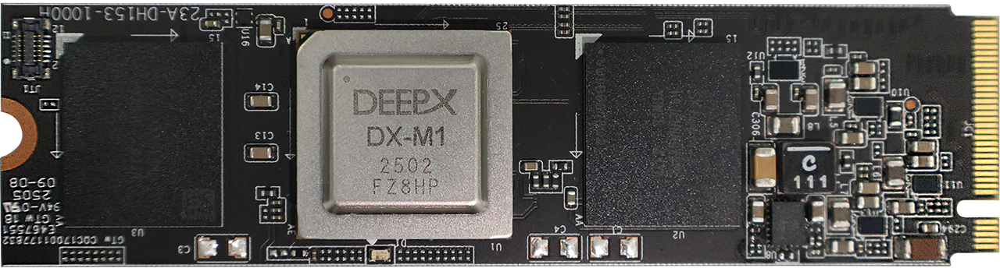

This section describes the hardware and software requirements for running **DX-COM**.  

**Hardware and Software Requirements**  

- **CPU:** x86 (x64)  
- **RAM:** ≥ 16 GB  
- **Storage:** ≥ 8 GB available disk space  
- **OS:** Ubuntu 18.04 / 20.04 / 22.04 / 24.04 (x64)  
- **LDD:** ≥ 2.28  

**Note.** To check your LDD version, run `ldd --version` in the terminal.  

{ width=700px }

 ---
