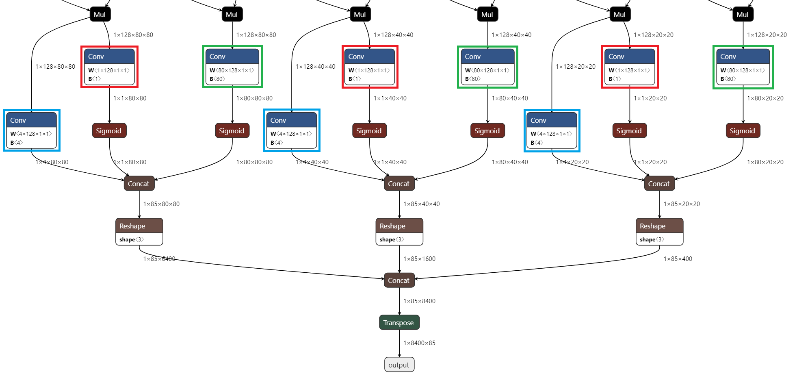

This chapter describes various parameters required for compiling an ONNX model using the **DX_COM**. It includes input specifications, calibration methods, data preprocessing settings, and optional parameters for advanced compilation schemes.  

These parameters are defined in a JSON file, which serves as a blueprint for how the compiler interprets and processes the input model.  

---

## Required Parameters  

**DEEPX** provides the following required parameters for configuring JSON files. These parameters **must** be defined to successfully compile an ONNX model.  

### Inputs  

Defines the input name and shape of the ONNX model.  

!!! warning "Model Input Restrictions"
    - The batch size <span style="color:red">**must**</span> be fixed to 1.  
    - **Only** a single input is supported.  
    - Input name **must** exactly match ONNX model definition.

Example  
```json
{
  "inputs": {
    "input.1": [1, 3, 512, 512]
  }
}
```

In this example, `"input.1"` is the name of the input tensor and its shape is `[1, 3, 512, 512]`, where:

- `1`: batch size (<span style="color:red">**must be 1**</span>)  
- `3`: number of channels (e.g., RGB)  
- `512 x 512`: image height and width

---

### Calibration Method  

Defines the calibration method used during quantization. It is essential for maintaining model accuracy after compilation by determining appropriate activation ranges.  

Available Methods

- `ema`:  
  Uses exponential moving average of activation values.  
  Recommended for improved post-quantization accuracy.  

- `minmax`:  
  Uses the minimum and maximum activation values to determine quantization range.

Example
```json
{
  "calibration_method": "ema"
}
```

In this example, the ema method is selected to compute more stable and accurate quantization thresholds.  

---

### Calibration Number

Defines the number of steps used during calibration. A higher number may improve quantization accuracy by better estimating activation ranges, but may also increase compile time.  
To minimize the accuracy degradation, it is recommended to try different values, such as 1, 5, 10, 100, or 1000, and determine the value that yields the best accuracy for your model.

Example
```json
{
  "calibration_num": 100
}
```

In this example, 100 samples from the calibration dataset will be used to determine activation ranges for quantization.  

---

### Calibration Data Loader  

Defines the dataset loader used during the calibration process. This parameter specifies the dataset location, accepted file types, and preprocessing steps to be applied before feeding data into the model.  

Parameter  

- `dataset_path`: The directory path where the calibration dataset is located.  
- `file_extensions`: A list of allowed file extensions for dataset files (case-sensitive). Only files with these extensions can be used.  
- `preprocessings`: Defines preprocessing steps applied to the calibration dataset. These steps should match the preprocessing used during inference to ensure consistency.  

Example
```json
{
  "default_loader": {
    "dataset_path": "/datasets/ILSVRC2012",
    "file_extensions": ["jpeg", "png", "jpg", "JPEG"],
    "preprocessings": [...]
  }
}
```

---

### Input Preprocessing Operations in `default_loader`  

The following preprocessing operations can be applied to input data for calibration or inference. These operations help standardize input formats and ensure consistency between calibration and deployment.  

**convertColor**  

Changes the color channel order of the input images. It is useful when the input image format (e.g., BGR or RGB) differs from what the model expects.  

Parameter  

- `form`: Defines the type of color space conversion.  
    - Supported values:`["RGB2BGR", "BGR2RGB", "RGB2GRAY", "BGR2GRAY", "RGB2YCrCb", "BGR2YCrCb", "RGB2YUV", "BGR2YUV", "RGB2HSV", "BGR2HSV", "RGB2LAB", "BGR2LAB"]`  

Example
```json
{
  "preprocessings": [
  {
    "convertColor": {
      "form": "BGR2RGB"
      }
    }
  ]
}
```

In this example, the color format is converted from BGR to RGB before being passed to the model.  

**resize**  

Resizes the input image to a specified target size.This operation is commonly used to match the model's expected input dimensions.  

Parameter  

- `mode`  
  : Defines the backend used for resizing.  
  : `default`: Uses OpenCV's resize function.  
  : `torchvision`: Uses PIL's resize function.  

- `size`  
  : Defines the target output image size.  
  : Accepts list, tuple, or integer.  
  : Cannot be used with `width` and `height`.  

- `width, height`  
  : Defines target width and height.  
  : Cannot be used with `size`.  

- `interpolation` (Optional)  
  : Defines the interpolation method during resizing.  
  : Default: `LINEAR`  

| Mode           | Supported Interpolation Methods               |
|----------------|-----------------------------------------------|
| `default`      | `LINEAR`, `NEAREST`, `CUBIC`, `AREA`, `LANCZOS4` |
| `torchvision`  | `BILINEAR`, `NEAREST`, `BICUBIC`, `LANCZOS`     |

Example for `default` mode (OpenCV)
```json
{
  "preprocessings": [
    {
      "resize": {
        "mode": "default",
        "width": 320,
        "height": 320,
        "interpolation": "LINEAR" # LINEAR, NEAREST, AREA, CUBIC, LANCZOS4
      }
    }
  ]
}
```

Example for `torchvision` mode (PIL-based) 
```json
{
  "preprocessings": [
    {
      "resize": {
        "mode": "torchvision",
        "size": 250,
        "interpolation": "BILINEAR" # NEAREST, BILINEAR, BICUBIC, LANCZOS

      }
    }
  ]
}
```

**centercrop**  

Crops the central region of the input image to the specified dimension. The crop is automatically centered based on the original image size.  

Parameter  

- `width`: The width of the crop region (in pixels)  
- `height`: The height of the crop region (in pixels)  

Example
```json
{
  "preprocessings": [
    {
      "centercrop": {
        "width": 224,
        "height": 224
      }
    }
  ]
}
```

In this example, a 224 × 224 region is cropped from the center of the input image.  


**transpose**  

Rearranges the dimensions of the input data based on the specified axis order. It is commonly used to convert between data formats.  

Parameter  

- `axis`: A list specifying the new order of axes  

Example
```json
{
  "preprocessings": [
    {
      "transpose": {
        "axis": [0, 2, 3, 1]
      }
    }
  ]
}
```

In this example, the tensor dimensions are rearranged to follow the `[batch, height, width, channels]` (NHWC) format.  


**expandDim**  

Adds a new dimension to the input tensor at the specified axis. It is commonly used to insert a batch or channel dimension when required by the model.  

Parameter  

- `axis`: The axis index where the new dimension should be inserted  

Example
```json
{
  "preprocessings": [
    {
      "expandDim": {
        "axis": 0
      }
    }
  ]
}
```

In this example, a new dimension is added at axis 0, typically used to add a batch dimension to an image tensor.  


**normalize**  

Normalizes the input data by applying mean and standard deviation values for each channel. This is commonly used to standardize input values before feeding them into a model.  

!!! warning "NPU Integration"  
    This operation may be integrated into the NPU graph depending on the model. Check the compiler log for "Inserting preprocessing operations to NPU graph". If integrated, <span style="color:red">**do not**</span> apply during runtime.

Parameter  

- `mean`: A list of mean values for each channel (e.g., R, G, B)  
- `std`: A list of standard deviation values for each channel  

Example
```json
{
  "preprocessings": [
    {
      "normalize": {
        "mean": [0.486, 0.486, 0.486],
        "std": [0.229, 0.229, 0.229]
      }
    }
  ]
}
```

In this example, the same mean and standard deviation values are applied to all three channels, typically used for normalized RGB images.  


**mul**  

Multiplies the input data by a specified constant value. It is commonly used for scaling input pixel values.  

Parameter  

- `x`: The constant value to multiply with the input data  

Example
```json
{
  "preprocessings": [
    {
      "mul": {
        "x": 255
      }
    }
  ]
}
```

In this example, the input data is scaled by a factor of 255.  


**add**  

Adds a constant value to the input data. This operation is commonly used to adjust the input data by a fixed offset, such as shifting pixel values.  

Parameter  

- `x`: The constant value to be added to each element of the input data  

Example
```json
{
  "preprocessings": [
    {
      "add": {
        "x": 255
      }
    }
  ]
}
```

In this example, the value 255 is added to each element of the input data.  


**subtract**  

Subtracts a constant value from the input data. This operation is commonly used to adjust pixel intensity values or normalize data by removing a fixed offset.  

!!! warning "NPU Integration"  
    This operation may be integrated into the NPU graph depending on the model. Check the compiler log for "Inserting preprocessing operations to NPU graph". If integrated, <span style="color:red">**do not**</span> apply during runtime.

Parameter  

- `x`: The constant value to subtract from each element of the input data  

Example
```json
{
  "preprocessings": [
    {
      "subtract": {
        "x": 255
      }
    }
  ]
}
```

In this example, the value 255 is subtracted from each element of the input data.  


**div**  

Divides the input data by a specified constant. It is commonly used to scale pixel values into a normalized range such as [0, 1].  

!!! warning "NPU Integration"  
    This operation may be integrated into the NPU graph depending on the model. Check the compiler log for "Inserting preprocessing operations to NPU graph". If integrated, <span style="color:red">**do not**</span> apply during runtime.

Parameter  

- `x`: The constant value to divide each element of the input data by (i.e., the divisor)  

Example
```json
{
  "preprocessings": [
    {
      "div": {
        "x": 255
      }
    }
  ]
}
```

In this example, all input values are divided by 255.  

---

### Custom Loader  

If the model's input is not an image, you can use a custom loader to provide the input data during calibration. The user **must** provide a Python script that defines a custom dataset class.  

**Guidelines for Writing a Dataset Class**  

Your custom dataset class **must** implement the following methods.  

- `__init__()`  
   : All constructor arguments **must** be optional, and have default values.  
- `__len__()`  
   : **Must** return the number of samples in the dataset.  
- `__getitem__()`  
   : **Must** return the data sample at the given index.  
   : The returned data **must** have a shape of either CHW (3-dimensional) or C.  (1-dimensional).  
   : The batch dimension (N) is automatically added by the system and is always set to 1.


**Recommendation**  

When using a custom loader, it is recommended to implement preprocessing logic directly within the dataset class, rather than relying on the preprocessing settings in the JSON configuration file.  

This approach offers the following benefits 

- Keeps data loading and transformation self-contained  
- Improve maintainability and debuggability  
- Provide flexibility for non-image input type


Example of `CustomDataset(Dataset)`  
```
  import pandas as pd
  import numpy as np
  from PIL import Image

  from torchvision import transforms
  from torch.utils.data import Dataset

  class CustomDataset(Dataset):
      def __init__(self, csv_path="./custom_loader_example/data/mnist_in_csv.csv", height=28, width=28):
        """
          Custom dataset example for reading data from csv

          Args: (should use default values for custom dataloader)
              csv_path (string): path to csv file
              height (int): image height
              width (int): image width
              transform: pytorch transforms for transforms and tensor conversion
        """
          self.data = pd.read_csv(csv_path)
          # self.labels = np.asarray(self.data.iloc[:, 0]) # not used for calibration
          self.height = height
          self.width = width
          self.transform = transforms.Compose([transforms.ToTensor()])
        
      def __len__(self):
          return len(self.data.index)

      def __getitem__(self, index):
          # Read each 784 pixels and reshape the 1D array ([784]) to 2D array ([28,28])
          img_as_np = np.asarray(self.data.iloc[index][1:]).reshape(self.height, self.width).astype('uint8')
        
         # Convert image from numpy array to PIL image, mode 'L' is for grayscale
          img_as_img = Image.fromarray(img_as_np)
          img_as_img = img_as_img.convert('L')

          # Transform image to tensor
          img_as_tensor = self.transform(img_as_img)
        
          # returned data shape should be CHW (3-dimensional) or C(1-dimensional)
          return img_as_tensor
```

**Using a Custom Loader in JSON configuration**  

To use a custom loader during calibration, you **must** specify the python dataset class in the JSON configuration.  

If the Python script file is named `dataset_module.py` and the dataset class is `CustomDataset`, the JSON configuration should be as follows.
```json
{
  "custom_loader": {
    "package": “dataset_module.CustomDataset”
  }
}
```

The Python script file **must** be in the same directory as the dx_com executable before execution.  

Example
```
  dx_com 
  ├── calibration_dataset 
  ├── dataset_module.py
  ├── dx_com 
  │ ├── cv2/ 
  │ ├── google/ 
  │ ├── numpy/ 
  │ ├── ... 
  │ └── dx_com 
  ├── sample 
  │ ├── MobilenetV1.json 
  │ └── MobilenetV1.onnx 
  └── Makefile
```

See also: Download the [Custom Dataloader Guide](http://cs.deepx.ai/_deepx_fae_archive/docs/Custom_Dataloader_Guide_241204.zip) file for more detailed instruction. 

---  

## Optional Parameters  

### Enhanced Quantization Scheme   

When quantizing a model, accuracy degradation may occur compared to the original model. To mitigate this, **Q-PRO options** (DXQ-P0 to DXQ-P5) can be used to enhance quantization performance. DXQ-P3 and DXQ-P4 generally offer better accuracy, so it is recommended to try them first.

| Name | Compilation Speed | Accuracy Improvement Tendency |
|------|------------------|-------------------------------|
| DXQ-P0 | Very Fast | Low |
| DXQ-P1 | Fast | Low-Middle |
| DXQ-P2 | Quite Slow | Middle-High |
| DXQ-P3 | Very Slow | High |
| DXQ-P4 | Very Slow | High |
| DXQ-P5 | Very Slow | High |

!!! note "NOTE"  
    Applying Q-PRO options <span style="color:red">**does not guarantee**</span> improved accuracy. Results may vary depending on the model and dataset.

!!! note "NOTE"  
    Due to a current limitation, compilation is only possible with **CPU**, which may significantly increase compile time.

**DXQ-P0**  
Uses an alpha value to control the strength of the quantization enhancement. This method is lightweight and fast, but may result in less accuracy gain compared to higher-level options.

Parameter  

- `alpha`: A float value between 0.0 and 1.0 that controls the level of enhancement.    
           Recommended value: 0.5  

Example
```json
{
  "enhanced_scheme": {
    "DXQ-P0": {
      "alpha": 0.5
    }
  }
}
```

In this example, the DXQ-P0 option is applied with a moderate enhancement level (alpha = 0.5).

**DXQ-P1**  
Enables a simple quantization improvement strategy by toggling the option on or off. This is a lightweight option with low to moderate accuracy gain and minimal impact on compilation time.  

Parameter  

- `Boolean flag`: Set to `true` to enable the DXQ-P1 enhancement. No additional configuration is required.  

Example
```json
{
  "enhanced_scheme": {
    "DXQ-P1": true
  }
}
```

In this example, the DXQ-P1 option is enabled to apply lightweight quantization enhancement.

**DXQ-P2**  
Uses a more refined strategy by adjusting `alpha`, `beta`, and `cosim_num` parameters. This option provides moderate to high accuracy improvement at the cost of slower compilation.

Parameter  

- `alpha`: A float value between 0.0 and beta.  
           Recommended value: 0.1  
- `beta`: A float value between alpha and infinity.  
           Recommended value: 1.0  
- `cosim_num`: An integer between 1 and infinity specifying the number of co-simulation runs.  
            Recommended value: 2  

Example
```json
{
  "enhanced_scheme": {
    "DXQ-P2": {
      "alpha": 0.1,
      "beta": 1.0,
      "cosim_num": 2
    }
  }
}
```

In this example, DXQ-P2 is configured with recommended values to balance accuracy improvement and compile time.

**DXQ-P3, DXQ-P4, DXQ-P5**  
These options support the optional `num_samples` parameter, which specifies the number of samples used during the quantization optimization process.  

Parameter  

- `num_samples`: An integer between 0 and infinity.  
                Recommended value: 1024

Example for DXQ-P3
```json
{
  "enhanced_scheme": {
    "DXQ-P3": {
      "num_samples": 1024
    }
  }
}
```

---

### PPU (Post-Processing Unit) Configuration

The PPU enables hardware-accelerated post-processing for object detection models. To use the PPU, define the `ppu` field in the configuration file with the appropriate type and parameters based on your model architecture.  

!!! note "NOTE"  
    While specific models are listed as verified, PPU supports any model with a similar detection head structure. If your model follows the same architectural pattern (anchor-based or anchor-free), it should work with the appropriate PPU type configuration.

**Supported PPU Types**  
The PPU configuration supports the following types of object detection architectures:  

- **Type 0 (Anchor-Based YOLO)**: Designed for models that use anchor boxes, such as YOLOv3, YOLOv4, YOLOv5, and YOLOv7.  
- **Type 1 (Anchor-Free YOLO)**: Designed for anchor-free models, such as YOLOX.  


**Type 0: Anchor-Based YOLO Models**  

- Supported Models: YOLOv3, YOLOv4, YOLOv5, YOLOv7  

This type supports anchor-based YOLO architectures with the following parameters:  

Parameter  

- `type`: Set to `0` for anchor-based YOLO models  
- `conf_thres`: Confidence threshold for detection filtering (float).   
    Note: This value is fixed during compilation and cannot be changed at runtime.  
- `num_classes`: Number of detection classes (integer)  
- `activation`: Activation function used in post-processing (mostly `"Sigmoid"`)  
- `layer`: Dictionary mapping convolution layer node names to their anchor configurations  
    - Each layer entry specifies `num_anchors`: Number of anchors used in that layer  

Example
```json
{
  "inputs": {
    "input.1": [1, 3, 640, 640]
  },
  "calibration_method": "ema",
  "calibration_num": 100,
  "ppu": {
    "type": 0,
    "conf_thres": 0.25,
    "activation": "Sigmoid",
    "num_classes": 80,
    "layer": {
      "Conv_245": {
        "num_anchors": 3
      },
      "Conv_294": {
        "num_anchors": 3
      },
      "Conv_343": {
        "num_anchors": 3
      }
    }
  }
}
```

**Type 1: Anchor-Free YOLO Models** 

- Supported Models: YOLOX  

This type supports anchor-free YOLO architectures with the following parameters:  

Parameter  

- `type`: Set to `1` for anchor-free YOLO models  
- `conf_thres`: Confidence threshold for detection filtering (float)  
    Note. This value is fixed during compilation and cannot be changed at runtime.  
- `num_classes`: Number of detection classes (integer)  
- `layer`: List of layer configurations, each containing  
   : `bbox`: Layer name that outputs bounding box coordinates  
   : `obj_conf`: Layer name that outputs object confidence scores  
   : `cls_conf`: Layer name that outputs class-wise confidence scores  

Example
```json
{
  "inputs": {
    "input.1": [1, 3, 640, 640]
  },
  "calibration_method": "ema",
  "calibration_num": 100,
  "ppu": {
    "type": 1,
    "conf_thres": 0.25,
    "num_classes": 80,
    "layer": [
      {
        "bbox": "Conv_261",
        "obj_conf": "Conv_262",
        "cls_conf": "Conv_254"
      },
      {
        "bbox": "Conv_282",
        "obj_conf": "Conv_283",
        "cls_conf": "Conv_275"
      },
      {
        "bbox": "Conv_303",
        "obj_conf": "Conv_304",
        "cls_conf": "Conv_296"
      }
    ]
  }
}
```

**How to Identify ONNX Node Names for PPU Configuration** 

To configure PPU, you need to identify specific Conv operation nodes in your ONNX model:  

**Step 1.** Open your model in [Netron](https://netron.app) to visualize the ONNX graph  

**Step 2.** For Type 0 (Anchor-based YOLO)  

- **Trace backwards from model outputs** using Netron to locate the detection head Conv layers  
- These Conv layers output feature maps with shape `[1, num_anchors*(5+num_classes), H, W]`  
- The multiplier before `(5+num_classes)` is the `num_anchors` value you need to configure in the PPU JSON  
- These Conv layers are typically followed by reshape, permute, and other post-processing operations  
- Example node names in YOLOv7: `/model.105/m.0/Conv`, `/model.105/m.1/Conv`, `/model.105/m.2/Conv` (one per detection scale)  

{ width=600px }

This diagram shows the **YOLOv7 Detection Head** . It highlights the three final `Conv` layers (e.g., `/model.105/m.0/Conv`) that produce predictions for different detection scales. These layers output a shape of `[1, num_anchors * (5 + num_classes), H, W]`. The Node Names and the `num_anchors` value are the exact parameters needed to configure PPU Type 0 (Anchor-Based) in the JSON file.


Configuration Example for the model shown above (YOLOv7 with 2 classes)  
```json
{
  "ppu": {
    "type": 0,
    "conf_thres": 0.25,
    "activation": "Sigmoid",
    "num_classes": 2,
    "layer": {
      "/model.105/m.0/Conv": {
        "num_anchors": 3
      },
      "/model.105/m.1/Conv": {
        "num_anchors": 3
      },
      "/model.105/m.2/Conv": {
        "num_anchors": 3
      }
    }
  }
}
```

**Step 3.** For Type 1 (Anchor-free YOLOX)  

- **Trace backwards from model outputs** using Netron to locate the detection head Conv layers  
- Find three types of Conv nodes for each detection scale  
    : `bbox`: Conv layer that outputs bounding box regression values  
    : `obj_conf`: Conv layer that outputs objectness confidence scores  
    : `cls_conf`: Conv layer that outputs class prediction scores  
- These three branches run in parallel for each scale level  
- This results in a total of 9 Conv layers (3 scales × 3 branches per scale)  

{ width=600px }

YOLOX detection head showing the nine Conv layers color-coded by function - blue boxes indicate bounding box (bbox) layers, red boxes indicate object confidence (obj_conf) layers, and green boxes indicate class confidence (cls_conf) layers. Each of the three detection scales has all three branch types.  

---