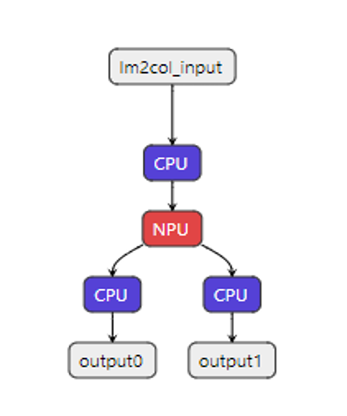
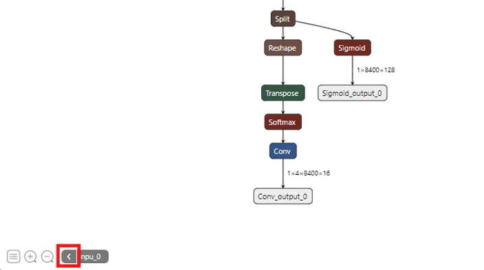
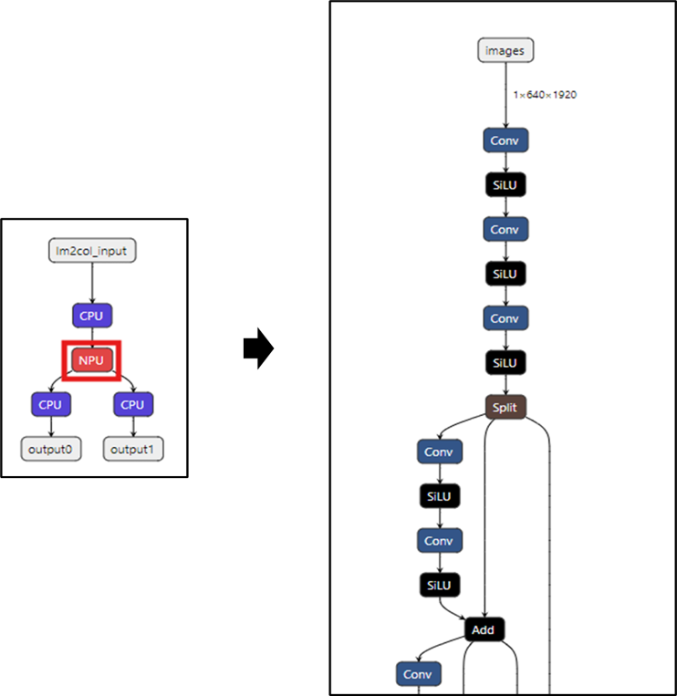

**DX-TRON** is a graphical visualization tool for inspecting .dxnn files compiled by the **DEEPX** toolchain. It provides intuitive insights into model architecture and highlights workload distribution between NPU and CPU components, helping developers better understand and optimize execution flow.

### Installation of DX-TRON  

**1.** Download the Installation File  
- Download the latest **DX-TRON** installation file from FTP or use the file provided.

**2.** Platform Support  
- Currently available for **Windows only**.  
- **Linux** and **MacOS** versions are **TBD** (To Be Determined).  

**3.** Install the Application  
- Run the setup file and follow the installation prompts.

**4.** Access  
- A **DX-TRON** shortcut icon is created on your Windows Desktop after installation.

### Execution of DX-TRON  

**1.** Launch **DX-TRON**  
- Double-click the Desktop shortcut to open the application.  

**2.** Open a Model File `(graph.dxnn)`  
- Drag and drop the file into the **DX-TRON** window, or.  
- Use the menu:  **File > Open**

**Note.** `.dxnn` file compiled with the `--shrink` option cannot be opened in DX-TRON.

### Key Features of DX-TRON  

Here are 4 key features of DX-TRON.  

**Supports Loading .dxnn Files**  
Load and visualize model files compiled by the DEEPX toolchain.  

**Visual Representation of Workloads**  

View color-coded workloads distribution  
- Red: NPU-executed operations  
- Blue: non-NPU (CPU or host) operations  
{ width=250px }

**Navigation Controls**  

Click the backward arrow in the bottom-left corner to return to the model overview screen.   
{ width=800px }

**Interactive Node Details**  
Double-click any node to inspect detailed operations associated with that part of the model. 
{ width=600px }

---
